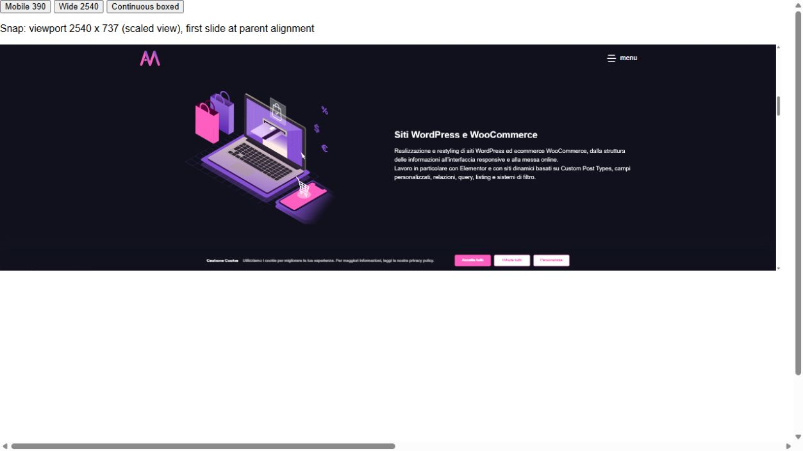
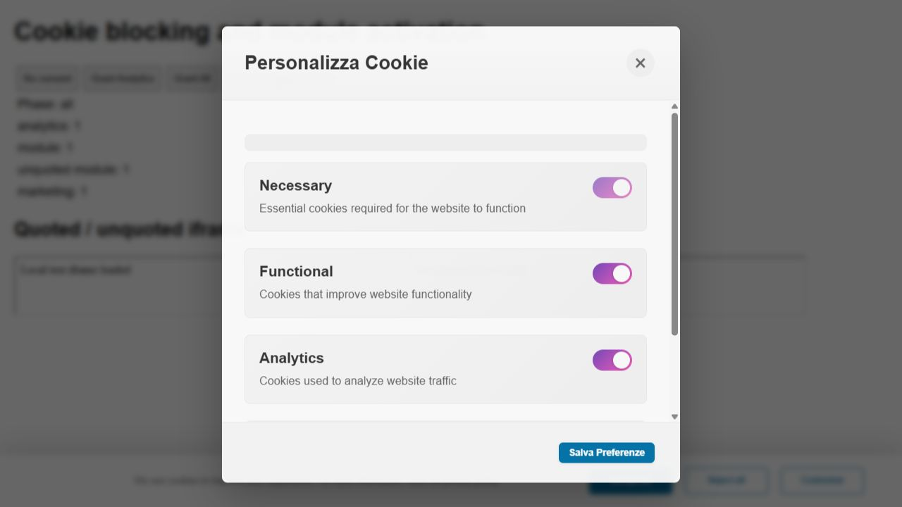
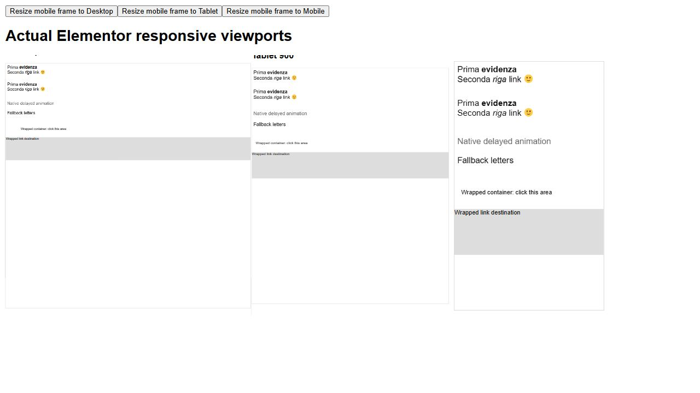

# Marrison Addon 1.3.44 — correzioni dell'audit

**Tutti i 21 problemi confermati nell'audit sono stati corretti nei sorgenti e nel plugin installato su LocalWP.** Sono stati aggiunti anche due controlli difensivi per dati legacy o malformati. Le verifiche coprono i casi descritti sotto; non certificano ogni configurazione possibile del plugin.

Versione finale: **1.3.44**, 1 ottobre 2026. Il cambio versione aggiorna anche gli URL degli asset per evitare il riutilizzo di JS/CSS precedenti nella cache del browser. Le modifiche preesistenti nel checkout sono state conservate. Le diagnosi originali restano nel [rapporto dell'audit](../REPORT.md), con le prove precedenti alle correzioni.

## Correzioni e prove

| N. | Componente e problema | Comportamento corretto | Verifica |
|---|---|---|---|
| 1 | Calendar Sync: ICS di eventi non pubblici | Verifica visibilità pubblica/capacità di lettura e protezione password prima di esportare | Bozza, privato, futuro e protetto negati all'utente anonimo; evento pubblico esportato |
| 2 | Updater: cartella GitHub annidata errata | Seleziona la cartella con `marrison-addon.php`, verifica il risultato e restituisce errori filesystem espliciti | Layout GitHub, ZIP installabile e cartella già corretta con filesystem WordPress reale; collisione/errore nei contratti |
| 3 | Calendar Sync: meta dello shortcode persi | Il link conserva le chiavi personalizzate in un contesto firmato, verificato prima di leggerle | Date personalizzate diverse dalle globali esportate correttamente; contesto alterato negato |
| 4 | Calendar Sync: luogo ICS vuoto | Conserva il luogo dello shortcode e applica escaping ICS | `Roma, Sala; 1` presente come `LOCATION:Roma\, Sala\; 1` |
| 5 | Calendar Sync: chiavi meta vuote | Ripristina i default per valori vuoti/non scalari, anche nelle impostazioni legacy | Sanitizer e percorsi shortcode verificati |
| 6 | Header Animations: tablet applicato sul desktop | Risolve l'animazione del dispositivo con l'ereditarietà responsive Elementor | Desktop vuoto, tablet DropSoft, mobile LettersFocus; resize nello stesso documento |
| 7 | Header Animations: markup e a capo rimossi | Divide i nodi di testo conservando `strong`, `em`, link e `br`; ripristina i nodi al cambio breakpoint | Heading reale nel browser; animazione nativa ritardata e fallback; contratti con breakpoint personalizzati |
| 8 | Wrapped Link: attributi custom ignorati | Applica gli attributi tramite il parser Elementor, proteggendo gli attributi di configurazione del modulo | `data-audit` e `aria-label` presenti; attributo evento scartato; click al target riuscito |
| 9 | Cursore: colore hover hex perso | Accetta anche colori esadecimali validi | Sanitizer reale: hex, rgb e rgba conservati; valore invalido usa il default |
| 10 | Image Sizes: metadata mancanti nel fallback | Registra file, dimensioni, MIME e peso della size generata prima delle sorgenti WebP/AVIF | PNG/WebP/AVIF 120×90 reali; metadata e lookup WordPress della size riusciti |
| 11 | Preloader: overlay bloccato con `href="#"` | Esclude anche l'hash vuoto della pagina corrente | Click reale: overlay nascosto, opacity 0 e pointer-events none |
| 12 | Preloader: navigazione già annullata forzata | Rispetta `event.defaultPrevented` | Click annullato conserva URL/stato; navigazione ordinaria raggiunge la destinazione |
| 13 | Cookie Manager: iframe con `src` non quotato caricato senza consenso | Parser condiviso per attributi quotati/non quotati; sposta `src` nell'attributo di blocco | Entrambi gli iframe restano senza `src` prima del consenso; caricati soltanto col consenso marketing |
| 14 | Cookie Manager: `type=module` perso alla riattivazione | Conserva il tipo originale durante il blocco e lo ripristina sul nuovo script | Script module quotato/non quotato eseguito una volta con consenso Analytics o completo |
| 15 | Local Google Fonts: test con percorso errato | Corrette entrambe le referenze al plugin annidato | Suite originale passa dal checkout; ultima esecuzione in directory temporanea dedicata, senza warning |
| 16 | Image Sizes: log debug residuo | Rimosso il log di sviluppo e il debug commentato | Sintassi JS e revisione del diff |
| 17 | Cookie Manager: titolo bianco nel popup bianco | Colore del titolo definito nel contesto del popup | Browser con regola globale h3 bianca: titolo `rgb(51,51,51)` su sfondo bianco |
| 18 | Scroll Orizzontale: child invisibili/dimensionamento del mover | Misura il contenuto intrinseco e mantiene il track utilizzabile nel layout reale | Pagina segnalata riprodotta con runtime Elementor; varianti Full/Boxed e child percentuali |
| 19 | Scroll Orizzontale: coordinate delle fermate Snap con padding | Usa le coordinate effettive delle slide e conserva il layout di Elementor | Contratti e prova con padding nella riproduzione della pagina |
| 20 | Scroll Orizzontale: seconda slide visibile nel Boxed senza Snap | Ritaglia il track alla larghezza reale del contenuto Boxed | Child 1640 px e secondo child oltre il bordo del ritaglio nel viewport 2540×1200 |
| 21 | Scroll Orizzontale: Snap anticipato con parent troppo alto | Conserva il Boxed; Snap parte dalla posizione superiore della scena; con Snap e Pin adatta le immagini allo spazio disponibile | 2540×737: parent alto 737, pin attivo e track iniziale 0; ingresso a 1 px senza cambio slide; primo gesto raggiunge il pin, successivo cambia slide |

Le cinque correzioni Cookie/Scroll già eseguite sono documentate nei rapporti [bugfixes](../bugfixes/REPORT.md) e [scroll-followup](../scroll-followup/REPORT.md). I 16 rilievi rimasti aperti sono chiusi da questa passata.

Controlli difensivi aggiuntivi, esclusi dal conteggio dei 21 bug confermati:

- Calendar Sync: un timezone legacy invalido usa il timezone del sito/UTC invece di interrompere l'export con un'eccezione. La prova reale genera un ICS.
- Ticker: gli elementi con `item_text` non scalare vengono saltati. Il probe con un array ora completa il render senza TypeError.

## Risultati finali

- **14/14 suite** superate: [contract-tests.json](contract-tests.json). Aggiunti contratti Updater, Cookie, Preloader e Header; estese le regressioni Scroll e immagini.
- **63/63 controlli sintattici**, 43 PHP e 20 JS: [syntax-checks.json](syntax-checks.json). `git diff --check -- marrison-addon tests` supera il controllo whitespace.
- **21/21 moduli isolati**, tutti spenti e tre scenari senza Elementor/JetEngine/WooCommerce: **25 esecuzioni**, nessun errore del plugin catturato. [summary.json](isolation/summary.json). L'inventory finale conferma versione 1.3.44 e tutti i moduli abilitati/caricati: [inventory-1.3.44.txt](isolation/inventory-1.3.44.txt).
- **78/78 file distribuibili** in LocalWP coincidono con il sorgente tramite hash: [installed-source-matches.json](installed-source-matches.json). `AGENTS.md` è escluso dalla distribuzione.
- Calendar: **8 casi** sull'endpoint reale WordPress, con dati temporanei in transazione e rollback. [calendar-results.json](calendar-results.json).
- Immagini/Cursore: generazione GD, metadata e sanitizer reali. [media-runtime-results.json](media-runtime-results.json).
- Updater: selezione/movimento mediante `WP_Filesystem_Direct`. [updater-runtime-results.json](updater-runtime-results.json).
- Header, Wrapped Link, Preloader e Cookie: DOM, navigazione e contatori di esecuzione nel browser con runtime/markup reali. [browser-results.json](browser-results.json).
- Scroll: misure, ingresso tramite rotella e resize desktop/mobile della riproduzione della pagina segnalata. [browser-results.json](../scroll-followup/browser-results.json).
- **11 fixture HTML rimosse** da LocalWP dopo verifica del percorso esatto e SHA256; copie conservate qui. [cleanup.json](cleanup.json). Valori di consenso del browser ripristinati; nessun record WordPress temporaneo residuo: [record-cleanliness.json](record-cleanliness.json).

Nel log dello strumento browser Cookie compare un errore `MutationObserver.observe` senza sorgente o stack. Il retest con un listener nativo della pagina non lo rileva (`nativePageError: null`); i contatori e il ripristino dei module passano. Non è stato attribuito al plugin e non viene presentato come risolto. L'errore di inizializzazione Header con breakpoint non ancora pronti, invece, è stato riprodotto, corretto e non compare nelle prove successive.

## Pacchetto

[marrison-addon-1.3.44.zip](../../../marrison-addon-1.3.44.zip) contiene **78 file**, con file principale a `marrison-addon/marrison-addon.php`. CRC, layout ed equivalenza byte per byte di tutti i membri col sorgente verificati. [package-results.json](package-results.json).

SHA256: `925fa86c6ea35874f52b56936b2c25d733b86418ebb767fbd243f1f6ef7f254d`.

Lo ZIP precedente `marrison-addon.zip` conserva il suo hash iniziale. Il sito online non è stato aggiornato.

La [verifica della consegna](delivery-verification.json) ricontrolla insieme esiti delle suite, conteggi, assenza delle fixture, file installati e contenuto dello ZIP. Lo script ripetibile è [verify-delivery.py](verify-delivery.py).

## Limiti ancora da verificare

- LocalWP segnala `php_imagick.dll` mancante; GD ha completato WebP/AVIF. FFmpeg è assente, quindi l'estrazione delle cover video non è stata certificata.
- La cache statica Nginx richiede la configurazione manuale del server indicata dal modulo. Qui non è stata applicata; Apache/LiteSpeed non sono disponibili.
- Non eseguiti un aggiornamento remoto da GitHub, import in client calendario, download font reali, tracker esterni/cross-domain o distribuzione online.
- Il runtime WordPress usa PHP 8.2.29, il lint/contratti PHP 8.5.5. Compatibilità PHP 7.4 non eseguita.
- Le verifiche responsive usano viewport reali in iframe; non certificano hardware touch, trackpad, tutte le varianti Motion Effects/antenati, ogni breakpoint/editor rerender o le altre integrazioni AJAX elencate nel rapporto iniziale.
- Per lo Scroll, un layout con testo/min-height/altri contenuti già più alti del viewport può ancora impedire il pin. L'adattamento richiesto riguarda le immagini; conserva le proporzioni e ripristina i vincoli al cambio modalità/breakpoint.

## Prove visive

